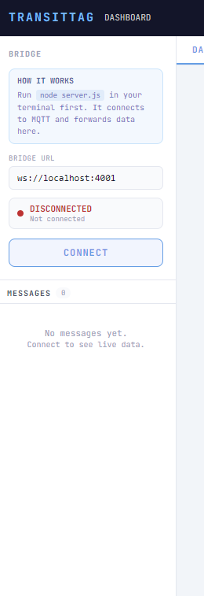
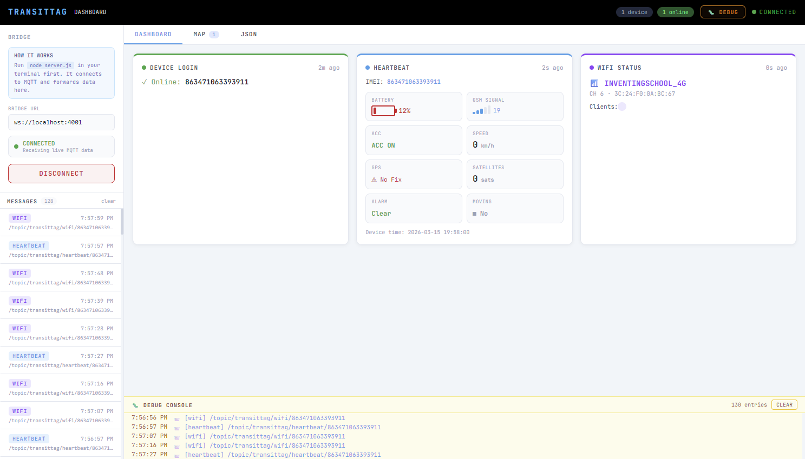
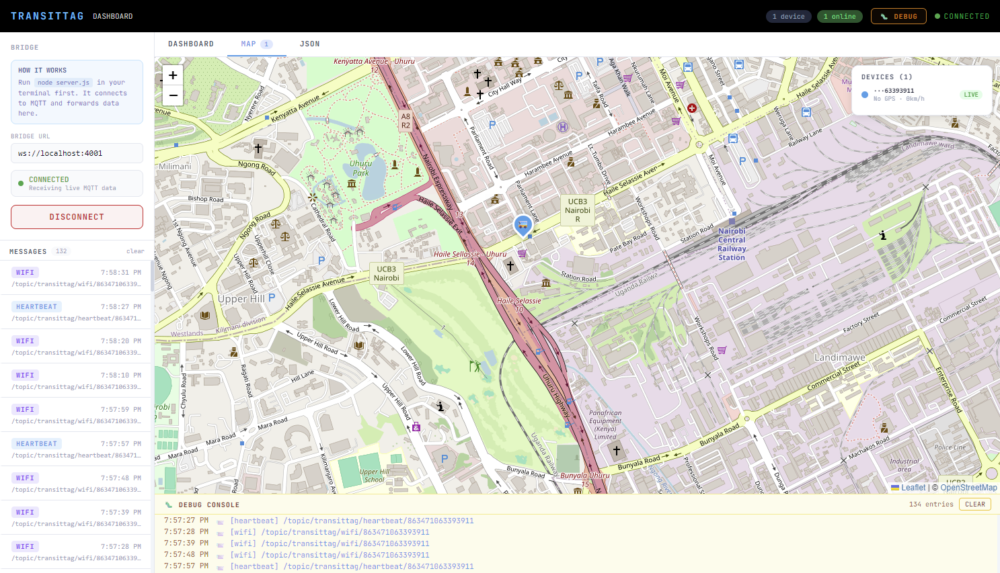
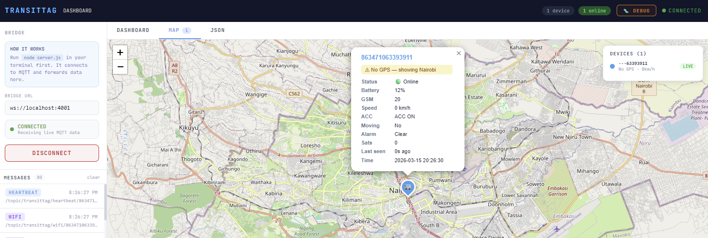
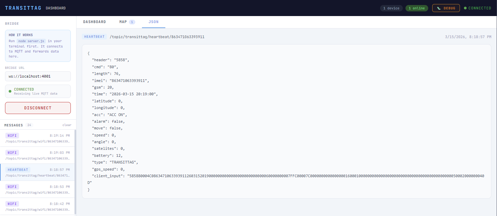
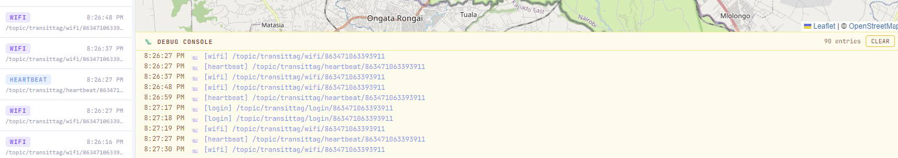
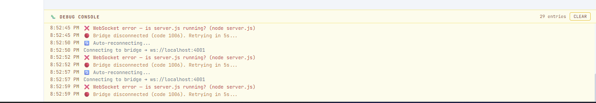

# 📡 TransitTag MQTT Dashboard
## Inventing School


## Changelog

| Version                          | Date            | Desc                                                                                       |
|----------------------------------|-----------------|--------------------------------------------------------------------------------------------|
| `1.0.0`                          | 13th March 2026 | Initial App                                                                                |
| `1.1.0`                          | 15th March 2026 | 1. Maps tab for location tracking (Leafletjs)<br/> 2. Debug Console<br/> 3. UI Enhancement |
|   |         |                                                                                            |

---

### Lesson 1 - Building a dashboard to display raw data from MQTT Broker

A real-time IoT telematics dashboard for monitoring **TransitTag** devices over MQTT. Built with **React + Vite** on the frontend and a lightweight **Node.js WebSocket bridge** on the backend.





## Tech Stack

| Layer | Technology | Purpose |
|---|---|---|
| UI Framework | React 18 + Vite | Dashboard interface |
| MQTT Client | `mqtt` npm package | Bridge connects to broker |
| WebSocket Server | `ws` npm package | Bridge serves browser clients |
| Environment Config | `dotenv` | Loads credentials from `.env` |
| Styling | Inline React styles | No CSS framework needed |

---
## 1. App Overview

### 1.1 Sidebar (Left Panel)
The sidebar is your connection control centre. Enter the WebSocket bridge URL
(default `ws://localhost:4001`) and click **CONNECT**. The status indicator
shows four states — **Disconnected**, **Connecting**, **Connected**, and
**Error**. Once connected, every incoming MQTT message appears in the message
list below, showing its type badge (HEARTBEAT, WIFI, RFID, LOGIN) and the
topic it arrived on. Click any message to jump straight to its raw JSON in the
JSON tab. You can clear the list at any time without disconnecting.

> The sidebar talks to `server.js`, not directly to the MQTT broker.
> `server.js` handles the broker connection over TCP and forwards packets
> to the browser over WebSocket.


---

### 1.2 Dashboard Tab
The dashboard tab shows the **latest state** of the connected device as live
cards — one card per message type. Cards update automatically every time a new
message arrives for that type. There are four card types:

- **Login Card** (green) — confirms the device is online and shows its IMEI.
- **Heartbeat Card** (blue) — the main telemetry card. Shows battery level,
  GSM signal strength, GPS coordinates, speed, satellite count, ACC status,
  alarm state, and whether the device is moving.
- **WiFi Card** (purple) — shows the device's hotspot name (SSID), channel,
  MAC address, and a list of all currently connected client devices with their
  IP and MAC addresses.
- **RFID Card** (amber) — shows the last 5 card tap events, including the
  user ID, station ID, scan status, and scan time.


---

### 1.3 Map Tab
The map tab plots every device on a live OpenStreetMap. Each device gets its
own colour, which stays consistent for the whole session. When no GPS fix is
available (coordinates are `0, 0`) the pin is placed at the centre of Nairobi
with a warning in the popup. Once a real GPS fix arrives the pin moves to the
correct location automatically.

Key map features:
- **Multiple device pins** — one pin per unique IMEI, all visible at once.
- **Trail line** — a dashed polyline showing the last 50 recorded GPS
  positions so you can see where the device has been.
- **Popup** — click any pin to see full device details: battery, speed, GSM,
  ACC, alarm, satellite count, and last seen time.
- **Device legend** — a floating panel (top right) lists all known devices
  with their colour, last coordinates, speed, and a LIVE / IDLE badge.
- **Auto-centre** — the map automatically fits all devices in view when GPS
  data arrives.
- **Tab badge** — the Map tab label shows a count of how many devices are
  being tracked.



---

### 1.4 JSON Tab
The JSON tab shows the full raw payload of whichever message you selected in
the sidebar. Click any message row in the sidebar list and the JSON tab opens
automatically with the complete pretty-printed JSON. This is useful for
inspecting exactly what the device is sending — field names, data types, and
values — without any formatting or transformation applied.



---

### 1.5 Debug Console (Bottom Panel)
The debug console is toggled on and off with the **🐛 DEBUG** button in the
top bar. When open it slides up from the bottom of the screen and shows a
timestamped log of every WebSocket event between the browser and `server.js`:

| Level     | What it means                                          |
|-----------|--------------------------------------------------------|
| `info`    | Connection attempts and subscription confirmations     |
| `success` | Successful connection or subscription                  |
| `warn`    | Disconnections and reconnect attempts                  |
| `error`   | WebSocket errors — usually means server.js is not running |
| `msg`     | Every incoming MQTT message with its topic and type    |

The debug console (currently)* shows **browser ↔ server.js** events only. If the MQTT
broker itself is refusing connections, those errors will appear in your
terminal where `server.js` is running, not here.





## 2. Architecture Overview

```
MQTT Broker (byte-iot.net:1883)
        ↓  TCP — handled by server.js
server.js (Node.js bridge)
        ↓  WebSocket ws://localhost:4001
React Dashboard (browser)
        ├── Sidebar        → connection control + message list
        ├── Dashboard Tab  → live device state cards
        ├── Map Tab        → GPS pins + trails on OpenStreetMap
        ├── JSON Tab       → raw message inspector
        └── Debug Console  → WebSocket event log
```


## 3. Project Structure

```
transittag-dashboard/
├── src/
│   ├── App.jsx          # React dashboard UI
│   ├── main.jsx         # React entry point
│   └── assets/img
│       ├── (images)
├── server.js            # Node.js WebSocket bridge
├── index.html
├── vite.config.js
├── package.json
├── .env                 # Your credentials (never commit this)
├── .env.example         # Template — safe to commit (Duplicate this)
└── README.md
```

## 4. How It Works

This dashboard listens to live MQTT messages from a TransitTag IoT device and displays them as real-time UI cards.

It handles **4 message types** from the device:

| Topic Pattern | Type | What It Shows |
|---|---|---|
| `/topic/transittag/heartbeat/{imei}` | 💙 Heartbeat | Battery, GPS, speed, GSM signal, ACC, alarms |
| `/topic/transittag/wifi/{imei}` | 🟣 WiFi | SSID, channel, connected clients & IPs |
| `/topic/transittag/rfid/{imei}` | 🟡 RFID | Card scans, user ID, station, status |
| `/topic/transittag/login/{imei}` | 🟢 Login | Device online/connect event |

---

### 4.1 Architecture — The Node.js Bridge & Why We Need It

This is the most important design decision in the project. Here's why a bridge is necessary:

### The Problem: Browsers Can't Use Raw TCP

MQTT brokers traditionally run on **port 1883** using raw **TCP sockets**. Browsers, however, are sandboxed environments — they can **only** make connections using **HTTP** or **WebSocket (WS)**. They have no ability to open a raw TCP socket.

```
❌ Browser → TCP:1883 → MQTT Broker    (BLOCKED — browsers can't do raw TCP)
```

Some brokers solve this by also exposing a **WebSocket port** (typically 8083 or 9001) that wraps MQTT in a WebSocket connection — which browsers *can* use. However, **not all brokers have this enabled**, and in this project the broker at `byte-iot.net` only exposes port `1883`.

```
❌ Browser → WS:8083  → byte-iot.net   (Port closed — broker doesn't support it)
```

### The Solution: A Local Bridge

We run a small **Node.js server (`server.js`)** locally. Node.js runs outside the browser, so it *can* open a raw TCP connection on port 1883.

The bridge:
1. Connects to the MQTT broker over **TCP:1883** (the Node.js way)
2. Subscribes to all relevant topics
3. Opens a **local WebSocket server** on port `4001`
4. Forwards every MQTT message it receives to the browser over WebSocket

```
✅  MQTT Broker (TCP:1883)
        ↕
    server.js  ← Node.js bridge running locally
        ↕  WebSocket (ws://localhost:4001)
    React App  ← running in the browser
```

This is a clean and widely-used pattern in IoT dashboards. The bridge is minimal — it does nothing except receive and forward. All the display logic lives in React.
 

## 5. Installation

### Prerequisites

- [Node.js](https://nodejs.org/) v18 or higher
- npm v9 or higher

### 5.1. Clone the Repository

```bash
git clone https://github.com/Aaron-Muuo/transittag-dashboard.git
cd transittag-dashboard
```

### 5.2. Install Dependencies

```bash
npm install
```

This installs everything needed: `leaflet`, `react`, `vite`, `mqtt`, `ws`, and `dotenv`.

### 5.3. Configure Your Credentials

Copy the example env file and fill in your broker details:

```bash
cp .env.example .env
```

Open `.env` and fill in your values:

```env
MQTT_BROKER=mqtt://your-broker-host:1883
MQTT_USERNAME=your_username
MQTT_PASSWORD=your_password
MQTT_TOPIC="/topic/transittag/#"   # Wrap topics in quotes
WS_PORT=4001
```

> ⚠️ **Never commit your `.env` file.** It's already listed in `.gitignore`.


## 6. Running the Project

You need **two terminals** running at the same time — one for the bridge, one for the UI.

### Terminal 1 — Start the Node.js Bridge

```bash
node server.js
```

You should see:

```
🔌 Connecting to MQTT broker: mqtt://your-broker:1883
✅ Connected to MQTT broker
📡 Subscribed to: /topic/transittag/#
🌐 WebSocket bridge running on ws://localhost:4001
```

The bridge is now connected to your MQTT broker and listening for messages.

### Terminal 2 — Start the React Dashboard

```bash
npm run dev
```

Then open your browser at:

```
http://localhost:5173
```

### Connect the Dashboard

1. The bridge URL field should already say `ws://localhost:4001`
2. Click the **CONNECT** button
3. The status indicator in the top-right will turn **green**
4. Live data will start appearing as cards

NB: Takes a while to receive data (Exercise patience)

## 7. Environment Variables Reference

| Variable | Description | Example                    |
|---|---|----------------------------|
| `MQTT_BROKER` | Full broker URL with protocol and port | `mqtt://byte-iot.net:1883` |
| `MQTT_USERNAME` | MQTT authentication username | `myusername`               |
| `MQTT_PASSWORD` | MQTT authentication password | `mypassword**`             |
| `MQTT_TOPIC` | Topic wildcard to subscribe to | `"/topic/transittag/#"`    |
| `WS_PORT` | Local WebSocket port for the bridge | `4001`                     |

> **Note on topic syntax:** Wrap your topic in quotes in the `.env` file if it contains a `#` wildcard, e.g. `MQTT_TOPIC="/topic/transittag/#"`. This prevents shell interpretation issues.

---

## 8. Troubleshooting

**Bridge says "Connection refused" or "getaddrinfo EAI_AGAIN"**
- Check your `MQTT_BROKER` value in `.env` — make sure the hostname and port are correct
- Confirm your machine has internet access
- Try pinging the broker: `ping byte-iot.net:1883`

**Dashboard stays "Disconnected" after clicking Connect**
- Make sure `server.js` is running in the other terminal
- Check the WebSocket URL in the UI matches `WS_PORT` in your `.env` (default: `ws://localhost:4001`)

**No messages appearing**
- Confirm your topic wildcard is correct — use `#` to catch all sub-topics
- Verify the device is online and publishing

**`node server.js` crashes immediately**
- Run `npm install` again to ensure all packages are installed
- Check your `.env` file exists and has no syntax errors


## 9. License

MIT — free to use, modify, and distribute.

---

> Built for the **TransitTag** IoT telematics platform. Connects field devices to a real-time web dashboard via MQTT over a local WebSocket bridge.