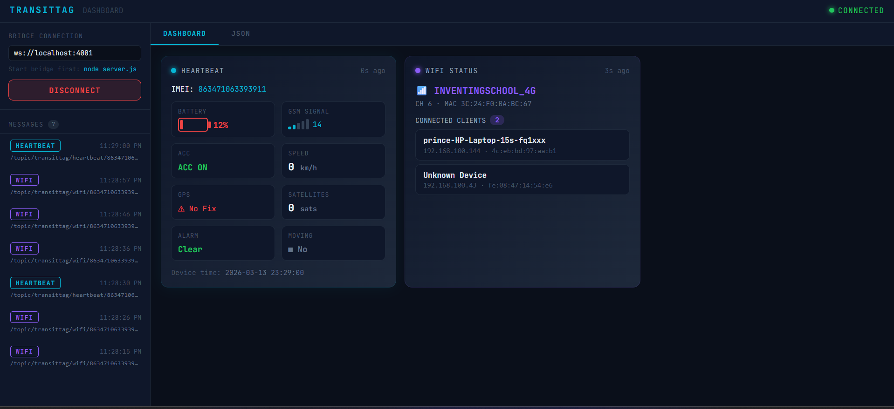
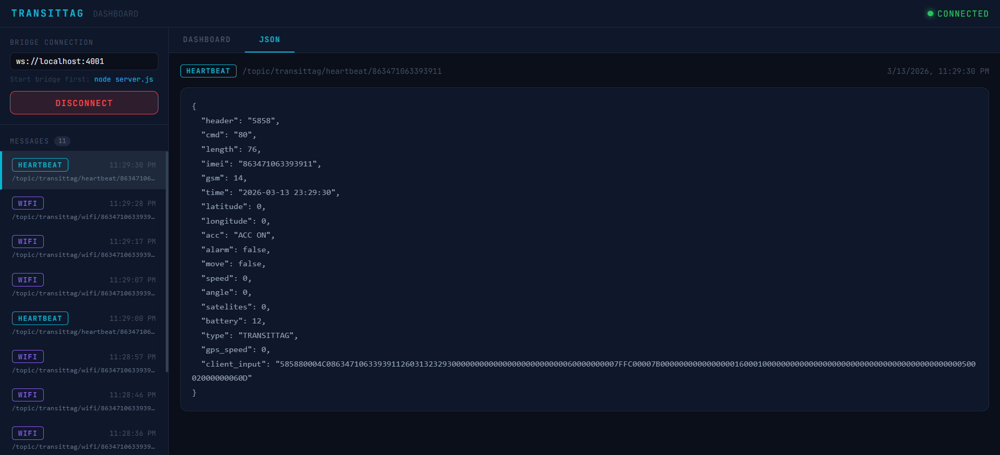

# 📡 TransitTag MQTT Dashboard

# Your Project Title


## Lesson 1 - Inventing School


A real-time IoT telematics dashboard for monitoring **TransitTag** devices over MQTT. Built with **React + Vite** on the frontend and a lightweight **Node.js WebSocket bridge** on the backend.




---

## 🗂️ Project Structure

```
transittag-dashboard/
├── src/
│   ├── App.jsx          # React dashboard UI
│   ├── main.jsx         # React entry point
│   └── assets/img
│       ├── screenshot_1.png
│       └── screenshot_2.png
├── server.js            # Node.js WebSocket bridge
├── index.html
├── vite.config.js
├── package.json
├── .env                 # Your credentials (never commit this)
├── .env.example         # Template — safe to commit (Duplicate this)
└── README.md
```

---

## ⚙️ How It Works

This dashboard listens to live MQTT messages from a TransitTag IoT device and displays them as real-time UI cards.

It handles **4 message types** from the device:

| Topic Pattern | Type | What It Shows |
|---|---|---|
| `/topic/transittag/heartbeat/{imei}` | 💙 Heartbeat | Battery, GPS, speed, GSM signal, ACC, alarms |
| `/topic/transittag/wifi/{imei}` | 🟣 WiFi | SSID, channel, connected clients & IPs |
| `/topic/transittag/rfid/{imei}` | 🟡 RFID | Card scans, user ID, station, status |
| `/topic/transittag/login/{imei}` | 🟢 Login | Device online/connect event |

---

## 🌉 Architecture — The Node.js Bridge & Why We Need It

This is the most important design decision in the project. Here's why a bridge is necessary:

### The Problem: Browsers Can't Use Raw TCP

MQTT brokers traditionally run on **port 1883** using raw **TCP sockets**. Browsers, however, are sandboxed environments — they can **only** make connections using **HTTP** or **WebSocket (WS)**. They have no ability to open a raw TCP socket.

```
❌ Browser → TCP:1883 → MQTT Broker    (BLOCKED — browsers can't do raw TCP)
```

Some brokers solve this by also exposing a **WebSocket port** (typically 8083 or 9001) that wraps MQTT in a WebSocket connection — which browsers *can* use. However, **not all brokers have this enabled**, and in this project the broker at `byte-iot.net` only exposes port `1883`.

```
❌ Browser → WS:8083  → byte-iot.net   (Port closed — broker doesn't support it)
```

### The Solution: A Local Bridge

We run a small **Node.js server (`server.js`)** locally. Node.js runs outside the browser, so it *can* open a raw TCP connection on port 1883.

The bridge:
1. Connects to the MQTT broker over **TCP:1883** (the Node.js way)
2. Subscribes to all relevant topics
3. Opens a **local WebSocket server** on port `4001`
4. Forwards every MQTT message it receives to the browser over WebSocket

```
✅  MQTT Broker (TCP:1883)
        ↕
    server.js  ← Node.js bridge running locally
        ↕  WebSocket (ws://localhost:4001)
    React App  ← running in the browser
```

This is a clean and widely-used pattern in IoT dashboards. The bridge is minimal — it does nothing except receive and forward. All the display logic lives in React.


---

## 🛠️ Installation

### Prerequisites

- [Node.js](https://nodejs.org/) v18 or higher
- npm v9 or higher

### 1. Clone the Repository

```bash
git clone https://github.com/YOUR_USERNAME/transittag-dashboard.git
cd transittag-dashboard
```

### 2. Install Dependencies

```bash
npm install
```

This installs everything needed: `react`, `vite`, `mqtt`, `ws`, and `dotenv`.

### 3. Configure Your Credentials

Copy the example env file and fill in your broker details:

```bash
cp .env.example .env
```

Open `.env` and fill in your values:

```env
MQTT_BROKER=mqtt://your-broker-host:1883
MQTT_USERNAME=your_username
MQTT_PASSWORD=your_password
MQTT_TOPIC="/topic/transittag/#"   # Wrap topics in quotes
WS_PORT=4001
```

> ⚠️ **Never commit your `.env` file.** It's already listed in `.gitignore`.

---

## 🚀 Running the Project

You need **two terminals** running at the same time — one for the bridge, one for the UI.

### Terminal 1 — Start the Node.js Bridge

```bash
node server.js
```

You should see:

```
🔌 Connecting to MQTT broker: mqtt://your-broker:1883
✅ Connected to MQTT broker
📡 Subscribed to: /topic/transittag/#
🌐 WebSocket bridge running on ws://localhost:4001
```

The bridge is now connected to your MQTT broker and listening for messages.

### Terminal 2 — Start the React Dashboard

```bash
npm run dev
```

Then open your browser at:

```
http://localhost:5173
```

### Connect the Dashboard

1. The bridge URL field should already say `ws://localhost:4001`
2. Click the **CONNECT** button
3. The status indicator in the top-right will turn **green**
4. Live data will start appearing as cards

NB: Takes a while to receive data (Exercise patience)

---

## 🖥️ Using the Dashboard

### Dashboard Tab
Shows live data cards, auto-updated whenever a new message arrives:

- **💙 Heartbeat Card** — Battery level bar, GSM signal bars, GPS fix status, speed, ACC on/off, alarm state, movement status
- **🟣 WiFi Card** — Access point SSID, channel, MAC address, and a list of all currently connected client devices with their IPs
- **🟡 RFID Card** — The last 5 card scans with user ID, station number, and scan time
- **🟢 Login Card** — Shown when the device first connects

### JSON Tab
Click any message in the left sidebar to view its full raw JSON payload — useful for debugging or inspecting raw data from the device.

---

## 🔐 Environment Variables Reference

| Variable | Description | Example |
|---|---|---|
| `MQTT_BROKER` | Full broker URL with protocol and port | `mqtt://byte-iot.net:1883` |
| `MQTT_USERNAME` | MQTT authentication username | `wayne123` |
| `MQTT_PASSWORD` | MQTT authentication password | `hunter2` |
| `MQTT_TOPIC` | Topic wildcard to subscribe to | `"/topic/transittag/#"` |
| `WS_PORT` | Local WebSocket port for the bridge | `4001` |

> **Note on topic syntax:** Wrap your topic in quotes in the `.env` file if it contains a `#` wildcard, e.g. `MQTT_TOPIC="/topic/transittag/#"`. This prevents shell interpretation issues.

---

## 🔧 Troubleshooting

**Bridge says "Connection refused" or "getaddrinfo EAI_AGAIN"**
- Check your `MQTT_BROKER` value in `.env` — make sure the hostname and port are correct
- Confirm your machine has internet access
- Try pinging the broker: `ping your-broker-host`

**Dashboard stays "Disconnected" after clicking Connect**
- Make sure `server.js` is running in the other terminal
- Check the WebSocket URL in the UI matches `WS_PORT` in your `.env` (default: `ws://localhost:4001`)

**No messages appearing**
- Confirm your topic wildcard is correct — use `#` to catch all sub-topics
- Verify the device is online and publishing

**`node server.js` crashes immediately**
- Run `npm install` again to ensure all packages are installed
- Check your `.env` file exists and has no syntax errors

---

## 📦 Tech Stack

| Layer | Technology | Purpose |
|---|---|---|
| UI Framework | React 18 + Vite | Dashboard interface |
| MQTT Client | `mqtt` npm package | Bridge connects to broker |
| WebSocket Server | `ws` npm package | Bridge serves browser clients |
| Environment Config | `dotenv` | Loads credentials from `.env` |
| Styling | Inline React styles | No CSS framework needed |

---

## 🗺️ Roadmap / Ideas

- [ ] Map view for GPS coordinates (Leaflet.js)
- [ ] Historical message log with export to CSV
- [ ] Multi-device support (track more than one IMEI)
- [ ] Alert notifications (alarm state, low battery)

---

## 📄 License

MIT — free to use, modify, and distribute.

---

> Built for the **TransitTag** IoT telematics platform. Connects field devices to a real-time web dashboard via MQTT over a local WebSocket bridge.